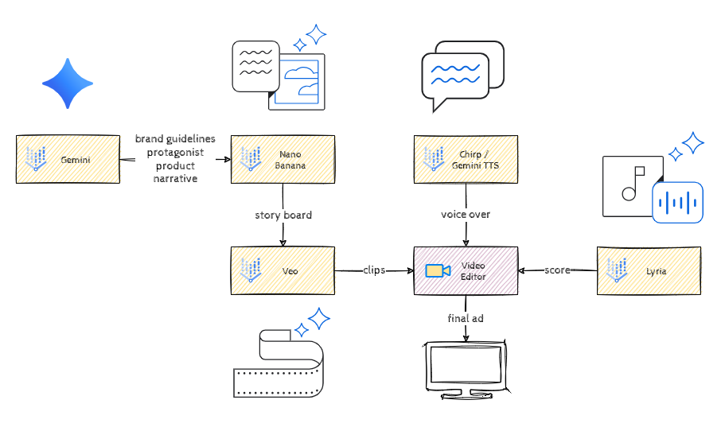

# Philly 250: Founding Fathers in Modern Philly GenMedia gHack

## Introduction

Welcome to the **Philly 250 GenMedia gHack**! In this high-octane creative workshop, you are the creative director for a historic milestone: Philadelphia’s 250th Anniversary (the Semiquincentennial).

Your mission is to produce a **30-to-60-second broadcast-quality commercial** answering the prompt: *"What would the Founding Fathers do in Modern Philly?"* This isn't just a hypothetical exercise—**Visit Philadelphia** is looking for the best AI-generated concepts to potentially inform their real-world 2026 tourism campaigns.

## Learning Objectives

*   **Storytelling with LLMs:** Use Gemini to bridge historical contexts with modern-day marketing narratives.
*   **Visual Consistency:** Master the "Character Reference" and "Reference to Video" workflows in Vertex AI to ensure a consistent protagonist.
*   **Multimodal Assembly:** Integrate high-fidelity video (Veo), images (Imagen 3), and custom audio (Lyria/TTS) into a polished final production.
*   **AI Video Production:** Understand the end-to-end pipeline of generating, editing, and scoring an AI-native commercial.

## Prerequisites

*   Basic understanding of Generative AI concepts (Prompt Engineering).
*   Access to a Google Cloud project with Vertex AI APIs enabled.
*   Familiarity with Google Vids or basic video editing timelines.

## Challenges - Table of Contents

1.  [Challenge 1: From History to Narrative](challenge-01.md)
2.  [Challenge 2: The Visual Blueprint](challenge-02.md)
3.  [Challenge 3: From Stills to Motion](challenge-03.md)
4.  [Challenge 4: The Assembly](challenge-04.md)
5.  [Challenge 5: Audio & Final Polish](challenge-05.md)

## Success Criteria

To win the "Founding Father" favor, your project must:

1.  **Meet the Duration:** A final export between 30 and 60 seconds.
2.  **Maintain Consistency:** The protagonist must be recognizable across all scenes.
3.  **Align with Branding:** Follow the **Visit Philly** brand guidelines provided in the briefing.
4.  **Audio Integration:** Features at least one custom AI voiceover and a generated soundtrack.

## Contributors

*   **Murat Eken**
*   **Gino Filicetti**
*   **Jeff Katzen**
*   **Justin Grayston**
*   **Len Henry**